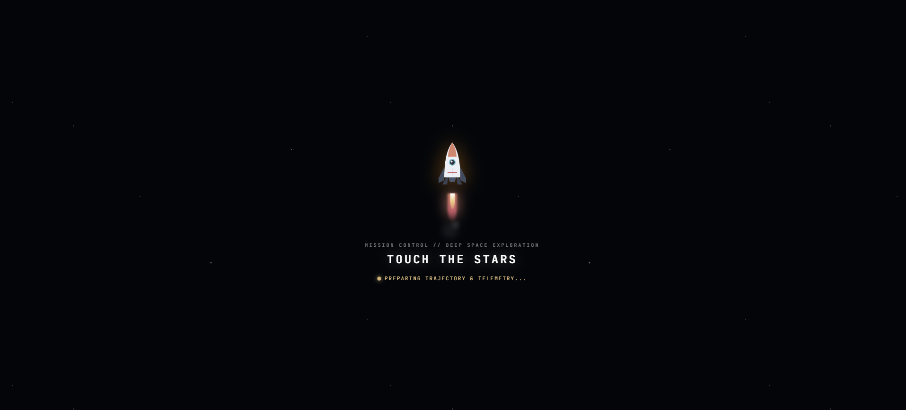

<div align="center">

# Touch The Stars

**An interactive 3D Solar System explorer, built in the browser.**


</div>



---

## Overview

All 8 planets orbit the Sun at scaled relative speeds, textured with real planet imagery. Click any planet — or the Sun — and the camera flies in for a close-up, showing detailed stats and facts about it. Click back and it glides out again while the system resumes orbiting.

The distances and orbital speeds aren't to real scale — the actual Solar System is mostly empty space and would be unusable as a visualization. What's kept accurate is the *relationship* between planets: orbital order, relative size, relative speed. Mercury really does orbit faster than Neptune, just compressed into something you can actually watch move.

## Controls

| Action | Input |
|---|---|
| Orbit camera | Click + drag |
| Zoom | Scroll / pinch |
| Select a planet | Click on it |
| Return to overview | Back button in the info panel |
| Pause / resume orbits | Pause button, top-right |

## Features

- All 8 planets and the Sun, textured, in correct orbital order
- Relative orbital speeds and rotation, animated continuously
- Click-to-select with a GSAP-eased camera transition, not an instant cut
- Info panel per object — diameter, distance from Sun, orbital period, moon count, mass, gravity, average temperature, day length, atmosphere composition
- A short list of facts for each planet and the Sun
- Saturn's rings
- Free-orbit camera controls
- Pause/play toggle for orbital motion
- Responsive layout — side panel on desktop and tablet, bottom sheet on mobile

## Tech Stack

```
Next.js 14      →  App Router, client-rendered canvas
Three.js        →  scene, camera, lighting, raycasting
GSAP            →  camera transitions
Plain CSS       →  UI
```

Textures from [Solar System Scope](https://www.solarsystemscope.com/textures/) (CC BY 4.0).

No backend, no database, no API keys. Static site — deployable anywhere that serves a Next.js app.

## How It Works

The scene is a single client-rendered `<canvas>` driven by a plain Three.js scene graph. Each planet's position updates every frame based on its own orbital angle, incremented at a speed scaled to its real relative orbital period.

Clicking a planet raycasts from the camera through the mouse position. On a hit, orbital motion pauses and GSAP takes over the camera, tweening its position and look-at target toward the selected planet over about 2 seconds with an ease-in-out curve. The info panel is a regular HTML overlay, not part of the WebGL scene, and reads from a static per-planet data file.

```
components/SceneCanvas.jsx   →  scene setup, animation loop, raycasting
components/InfoPanel.jsx     →  planet/sun stat panel
js/planets.js                →  planet + sun data
public/textures/             →  planet & ring textures
```

## Running Locally

```bash
git clone https://github.com/Zeyad-101/Touch-The-Stars.git
cd Touch-The-Stars
npm install
npm run dev
```

Open `http://localhost:3000`. Textures are already in `public/textures/`, so nothing extra to download.

## Notes

- Vanilla Three.js inside Next.js App Router needs to be mounted client-only (`dynamic(..., { ssr: false })`), otherwise it breaks on `window is not defined`.
- Handing control back and forth between OrbitControls and a GSAP-driven camera tween needs an explicit disable/re-enable step, or they fight each other for the camera.
- `RingGeometry`'s default UV mapping doesn't work for a radial texture like Saturn's rings — needed a manual remap.
- A scene lit by a single point light (the Sun) needs a decent amount of ambient light and `decay: 0` on the point light, or the outer planets go nearly black.

---

<div align="center">

Built by [Zeyad Waled](https://github.com/Zeyad-101)

</div>
